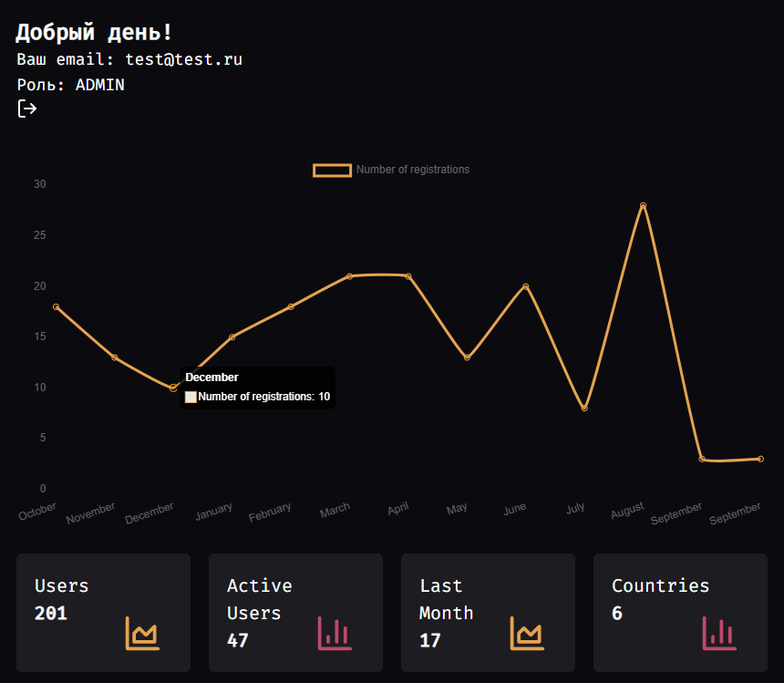
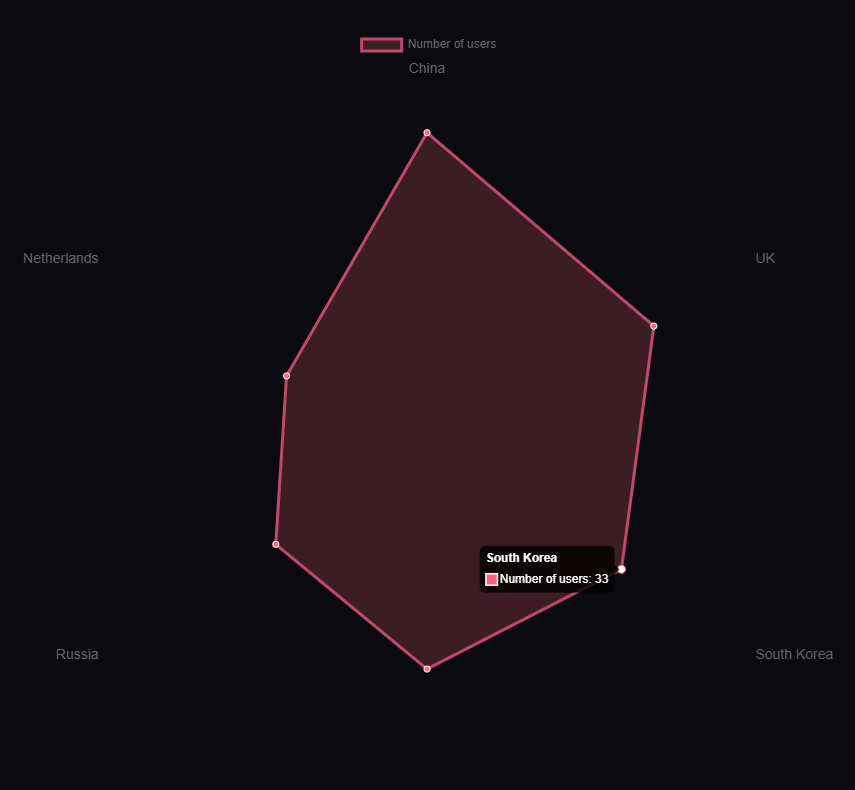
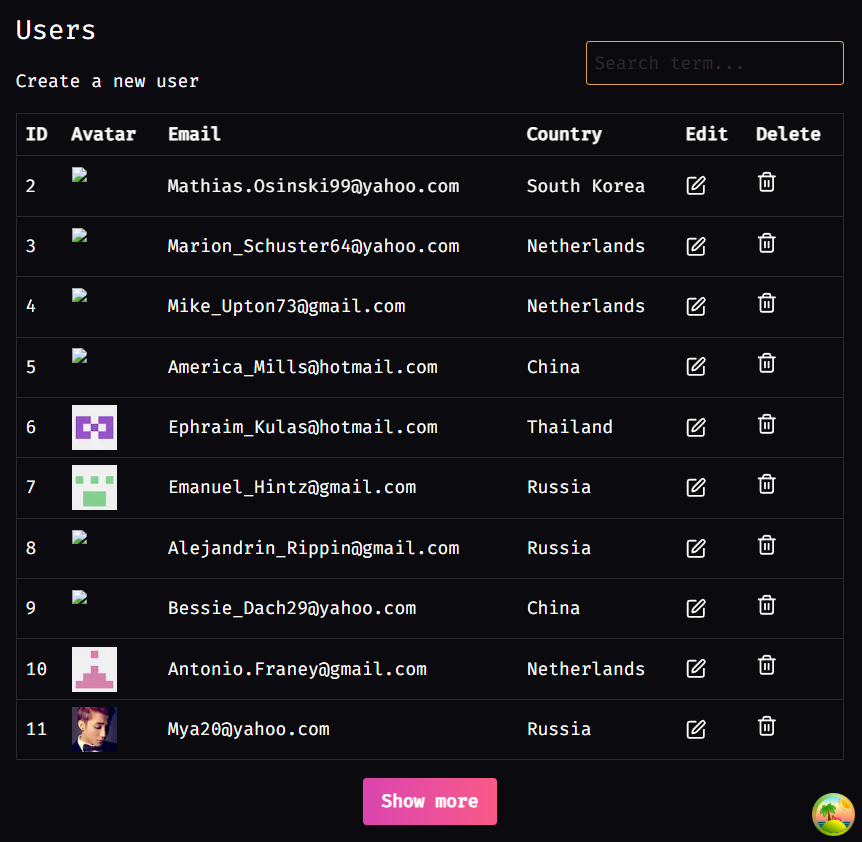
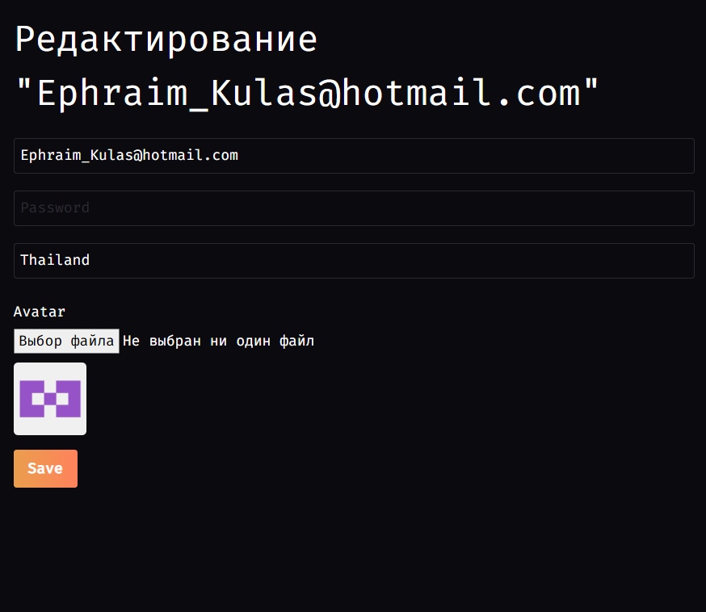

# Admin Panel

## Stack
**Back-end:**  
- Nest.js  
- Prisma  
- PostgreSQL  

**Front-end:**  
- Next.js  
- React  
- TypeScript  

## Features
- Авторизация с ролями
- Dashboard: графики (статистика) и панель с важными цифрами
- Управление пользователями и другими сущностями с поиском и пагинацией
- Форма создания и редактирования любой сущности
- Глобальные настройки сайта в админ панели
- Загрузка файлов
- Уведомления
- Интеграция с внешними сервисами по API
- Отправка E-mail писем

## Screenshots
### Dashboard с графиками

### Управление пользователями

